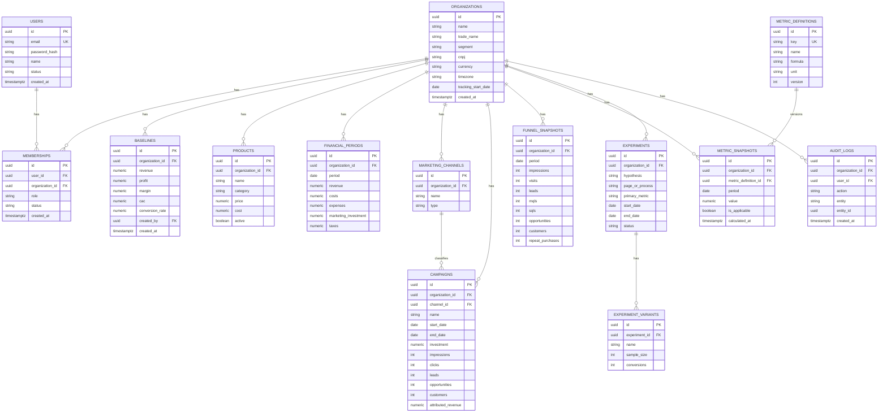

# Diagrama Entidade-Relacionamento (MVP)

```mermaid
erDiagram
    USERS ||--o{ MEMBERSHIPS : has
    ORGANIZATIONS ||--o{ MEMBERSHIPS : has
    ORGANIZATIONS ||--o{ BASELINES : has
    ORGANIZATIONS ||--o{ PRODUCTS : has
    ORGANIZATIONS ||--o{ FINANCIAL_PERIODS : has
    ORGANIZATIONS ||--o{ MARKETING_CHANNELS : has
    ORGANIZATIONS ||--o{ CAMPAIGNS : has
    ORGANIZATIONS ||--o{ FUNNEL_SNAPSHOTS : has
    ORGANIZATIONS ||--o{ METRIC_SNAPSHOTS : has
    ORGANIZATIONS ||--o{ EXPERIMENTS : has
    ORGANIZATIONS ||--o{ AUDIT_LOGS : has
    MARKETING_CHANNELS ||--o{ CAMPAIGNS : classifies
    METRIC_DEFINITIONS ||--o{ METRIC_SNAPSHOTS : versions
    EXPERIMENTS ||--o{ EXPERIMENT_VARIANTS : has

    USERS {
        uuid id PK
        string email UK
        string password_hash
        string name
        string status
        timestamptz created_at
    }
    ORGANIZATIONS {
        uuid id PK
        string name
        string trade_name
        string segment
        string cnpj
        string currency
        string timezone
        date tracking_start_date
        timestamptz created_at
    }
    MEMBERSHIPS {
        uuid id PK
        uuid user_id FK
        uuid organization_id FK
        string role
        string status
        timestamptz created_at
    }
    BASELINES {
        uuid id PK
        uuid organization_id FK
        numeric revenue
        numeric profit
        numeric margin
        numeric cac
        numeric conversion_rate
        uuid created_by FK
        timestamptz created_at
    }
    PRODUCTS {
        uuid id PK
        uuid organization_id FK
        string name
        string category
        numeric price
        numeric cost
        boolean active
    }
    FINANCIAL_PERIODS {
        uuid id PK
        uuid organization_id FK
        date period
        numeric revenue
        numeric costs
        numeric expenses
        numeric marketing_investment
        numeric taxes
    }
    MARKETING_CHANNELS {
        uuid id PK
        uuid organization_id FK
        string name
        string type
    }
    CAMPAIGNS {
        uuid id PK
        uuid organization_id FK
        uuid channel_id FK
        string name
        date start_date
        date end_date
        numeric investment
        int impressions
        int clicks
        int leads
        int opportunities
        int customers
        numeric attributed_revenue
    }
    FUNNEL_SNAPSHOTS {
        uuid id PK
        uuid organization_id FK
        date period
        int impressions
        int visits
        int leads
        int mqls
        int sqls
        int opportunities
        int customers
        int repeat_purchases
    }
    METRIC_DEFINITIONS {
        uuid id PK
        string key UK
        string name
        string formula
        string unit
        int version
    }
    METRIC_SNAPSHOTS {
        uuid id PK
        uuid organization_id FK
        uuid metric_definition_id FK
        date period
        numeric value
        boolean is_applicable
        timestamptz calculated_at
    }
    EXPERIMENTS {
        uuid id PK
        uuid organization_id FK
        string hypothesis
        string page_or_process
        string primary_metric
        date start_date
        date end_date
        string status
    }
    EXPERIMENT_VARIANTS {
        uuid id PK
        uuid experiment_id FK
        string name
        int sample_size
        int conversions
    }
    AUDIT_LOGS {
        uuid id PK
        uuid organization_id FK
        uuid user_id FK
        string action
        string entity
        uuid entity_id
        timestamptz created_at
    }
```

Ver decisões de constraint/índice em [schema-notes.md](schema-notes.md) e estratégia de isolamento em [ADR-0003](../adr/0003-estrategia-multi-tenancy.md).
