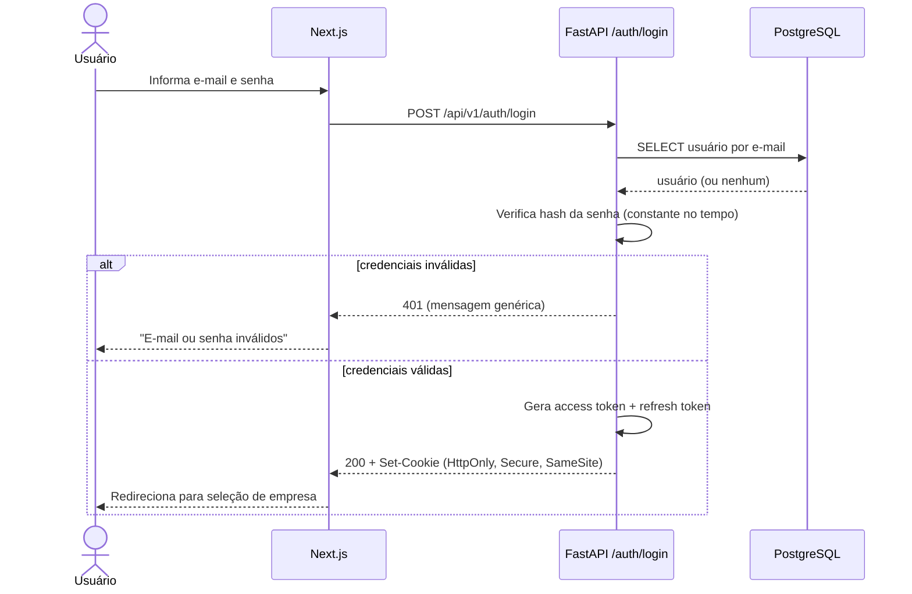
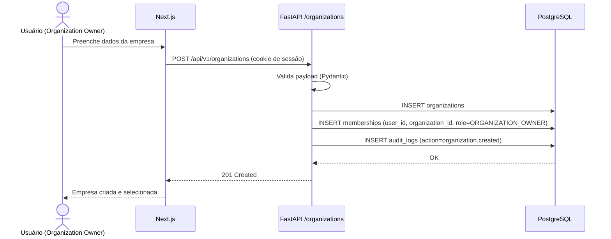
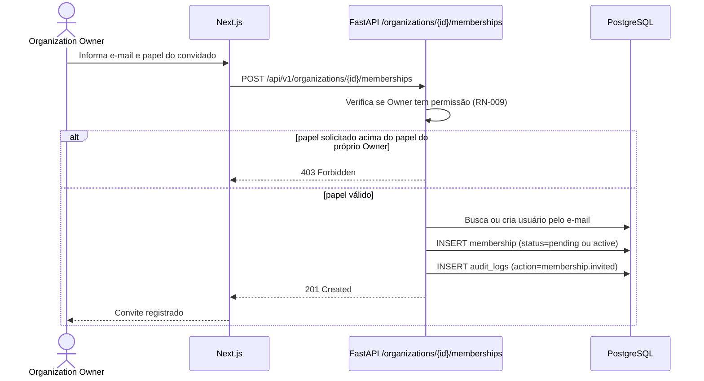

# Sequência — Login, Cadastro de Empresa, Criação/Convite de Usuário

## Login

```mermaid
sequenceDiagram
    actor U as Usuário
    participant W as Next.js
    participant A as FastAPI /auth/login
    participant DB as PostgreSQL

    U->>W: Informa e-mail e senha
    W->>A: POST /api/v1/auth/login
    A->>DB: SELECT usuário por e-mail
    DB-->>A: usuário (ou nenhum)
    A->>A: Verifica hash da senha (constante no tempo)
    alt credenciais inválidas
        A-->>W: 401 (mensagem genérica)
        W-->>U: "E-mail ou senha inválidos"
    else credenciais válidas
        A->>A: Gera access token + refresh token
        A-->>W: 200 + Set-Cookie (HttpOnly, Secure, SameSite)
        W-->>U: Redireciona para seleção de empresa
    end
```

## Cadastro de empresa

```mermaid
sequenceDiagram
    actor U as Usuário (Organization Owner)
    participant W as Next.js
    participant A as FastAPI /organizations
    participant DB as PostgreSQL

    U->>W: Preenche dados da empresa
    W->>A: POST /api/v1/organizations (cookie de sessão)
    A->>A: Valida payload (Pydantic)
    A->>DB: INSERT organizations
    A->>DB: INSERT memberships (user_id, organization_id, role=ORGANIZATION_OWNER)
    A->>DB: INSERT audit_logs (action=organization.created)
    DB-->>A: OK
    A-->>W: 201 Created
    W-->>U: Empresa criada e selecionada
```

## Convite de usuário

```mermaid
sequenceDiagram
    actor Owner as Organization Owner
    participant W as Next.js
    participant A as FastAPI /organizations/{id}/memberships
    participant DB as PostgreSQL

    Owner->>W: Informa e-mail e papel do convidado
    W->>A: POST /api/v1/organizations/{id}/memberships
    A->>A: Verifica se Owner tem permissão (RN-009)
    alt papel solicitado acima do papel do próprio Owner
        A-->>W: 403 Forbidden
    else papel válido
        A->>DB: Busca ou cria usuário pelo e-mail
        A->>DB: INSERT membership (status=pending ou active)
        A->>DB: INSERT audit_logs (action=membership.invited)
        A-->>W: 201 Created
        W-->>Owner: Convite registrado
    end
```
