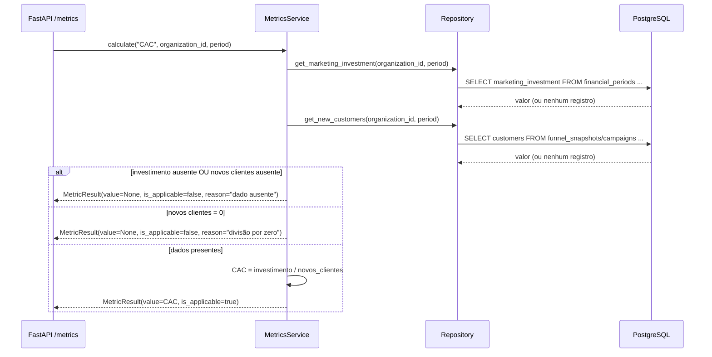
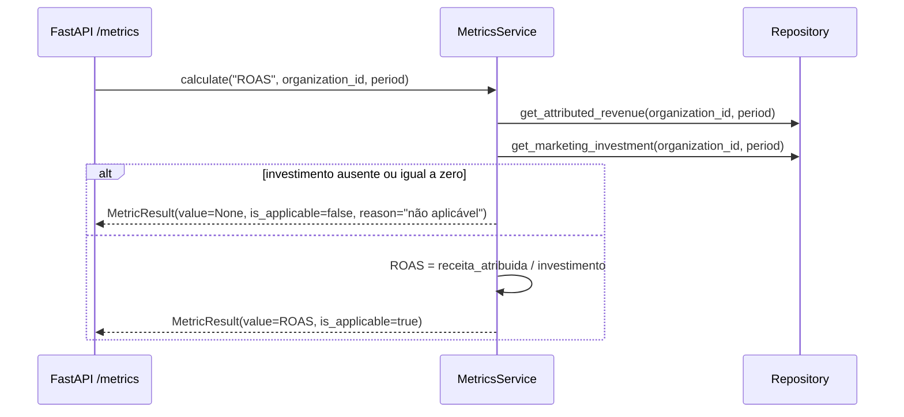
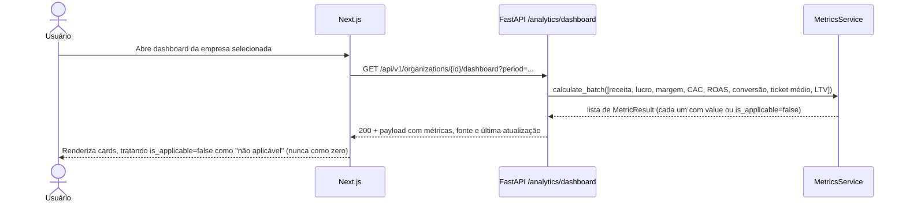

# Sequência — Cálculo de CAC, ROAS e Visualização de Dashboard

## Cálculo de CAC

```mermaid
sequenceDiagram
    participant API as FastAPI /metrics
    participant Svc as MetricsService
    participant Repo as Repository
    participant DB as PostgreSQL

    API->>Svc: calculate("CAC", organization_id, period)
    Svc->>Repo: get_marketing_investment(organization_id, period)
    Repo->>DB: SELECT marketing_investment FROM financial_periods ...
    DB-->>Repo: valor (ou nenhum registro)
    Svc->>Repo: get_new_customers(organization_id, period)
    Repo->>DB: SELECT customers FROM funnel_snapshots/campaigns ...
    DB-->>Repo: valor (ou nenhum registro)
    alt investimento ausente OU novos clientes ausente
        Svc-->>API: MetricResult(value=None, is_applicable=false, reason="dado ausente")
    else novos clientes = 0
        Svc-->>API: MetricResult(value=None, is_applicable=false, reason="divisão por zero")
    else dados presentes
        Svc->>Svc: CAC = investimento / novos_clientes
        Svc-->>API: MetricResult(value=CAC, is_applicable=true)
    end
```

## Cálculo de ROAS

```mermaid
sequenceDiagram
    participant API as FastAPI /metrics
    participant Svc as MetricsService
    participant Repo as Repository

    API->>Svc: calculate("ROAS", organization_id, period)
    Svc->>Repo: get_attributed_revenue(organization_id, period)
    Svc->>Repo: get_marketing_investment(organization_id, period)
    alt investimento ausente ou igual a zero
        Svc-->>API: MetricResult(value=None, is_applicable=false, reason="não aplicável")
    else
        Svc->>Svc: ROAS = receita_atribuida / investimento
        Svc-->>API: MetricResult(value=ROAS, is_applicable=true)
    end
```

## Visualização de dashboard

```mermaid
sequenceDiagram
    actor U as Usuário
    participant W as Next.js
    participant API as FastAPI /analytics/dashboard
    participant Svc as MetricsService

    U->>W: Abre dashboard da empresa selecionada
    W->>API: GET /api/v1/organizations/{id}/dashboard?period=...
    API->>Svc: calculate_batch([receita, lucro, margem, CAC, ROAS, conversão, ticket médio, LTV])
    Svc-->>API: lista de MetricResult (cada um com value ou is_applicable=false)
    API-->>W: 200 + payload com métricas, fonte e última atualização
    W-->>U: Renderiza cards, tratando is_applicable=false como "não aplicável" (nunca como zero)
```
